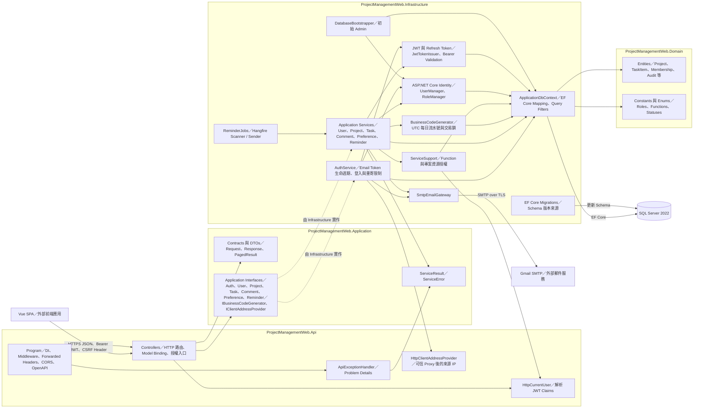
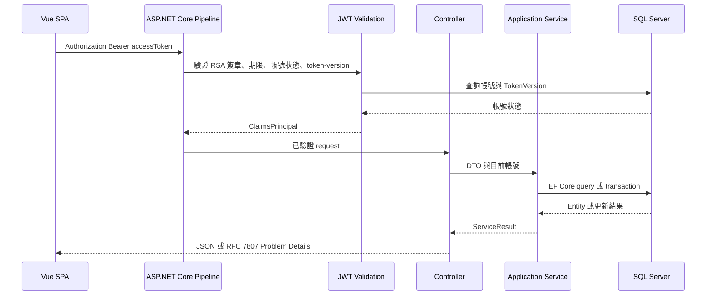
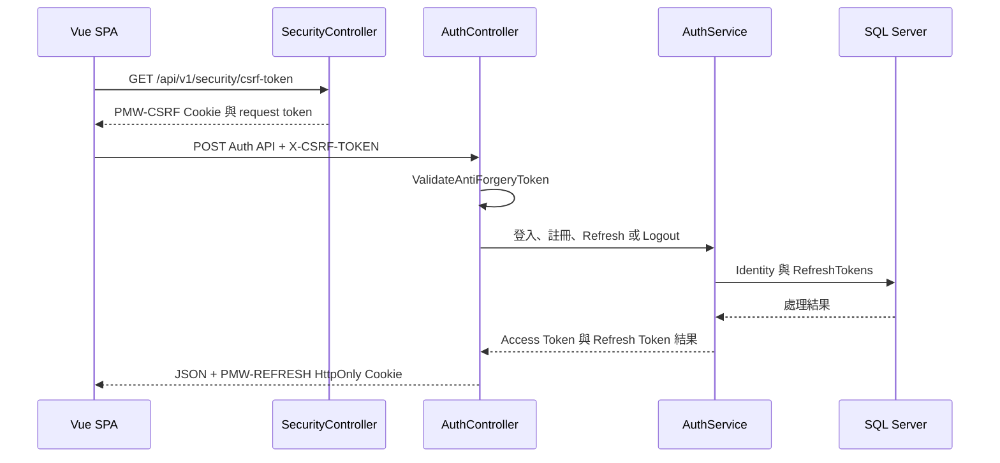
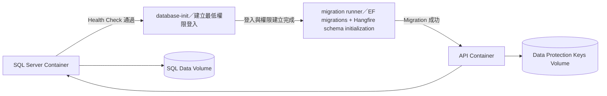

# 系統架構

本文件依目前 repository 的程式碼描述 ProjectManagementWeb BackEnd。圖採 C4 Model Level 3（Component Diagram）的視角，重點是 API 容器內的元件、責任與依賴；Vue SPA 與外部基礎設施只作為互動邊界。目前 API 採 Controller-based 架構，共 40 個 `/api/v1` actions，Application schema 共 26 張資料表。

## Level 3 Component Diagram



## 元件職責

| 元件 | 主要職責 | 不負責的事項 |
|---|---|---|
| `Program` | 組裝 DI、Forwarded Headers、Problem Details、CSRF、CORS、OpenAPI、Authentication、Hangfire recurring jobs 與路由管線 | 業務規則與資料存取 |
| Controllers | 接收 HTTP request、套用 `[Authorize]`／Function policy、呼叫 Application interface、轉換 HTTP status | 直接操作 `DbContext` |
| Application contracts | 定義 API DTO、service interface、分頁與統一服務結果 | EF Core、SMTP 或 HTTP 實作 |
| Infrastructure services | 實作帳號、個人資料、偏好、專案、Task、留言、提醒等 use case 與 transaction boundary | HTTP response 格式 |
| `ReminderJobs`／`ReminderService` | 每分鐘觸發 Scanner／Sender；依 Project 當地 08:00、七日視窗、SQL 原子 claim 與 5／15／60 分鐘 retry 執行提醒 | 在 Log 寫入 Email、Token、密碼或郵件本文 |
| `ServiceSupport` | 計算全域 Function 與專案成員／ProjectManager 的資源權限 | 驗證密碼與簽發 token |
| Identity／Token | 帳號驗證、唯一系統角色、JWT 簽發與 token-version、Refresh Token rotation | 專案角色授權 |
| `AuthService` | 管理 3 分鐘單次 Email Token、重寄冷卻／上限、15 分鐘登入失敗限制；來源資訊只保存 SHA-256 hash | 在回應或 Log 洩漏帳號是否存在、Token 或 IP 原文 |
| `ApplicationDbContext` | EF Core mapping、關聯、索引、query filter 與 seed data | 執行 HTTP 層驗證 |
| `BusinessCodeGenerator` | 使用 UTC 日期與 SQL Server transaction lock 產生 Project／Task 每日獨立業務編號 | 在建立交易之外保存或預留編號 |
| Domain | 業務實體、固定角色／Function 與狀態列舉 | 基礎設施連線與框架組態 |
| `SmtpEmailGateway` | 經 SMTP 寄送 Email 驗證信與 Task 到期提醒，回傳 provider response ID | 決定註冊 transaction 是否成功 |

## 主要執行流程

### Bearer 業務請求



### Cookie-sensitive Auth 請求



## 依賴方向與現況說明

```text
Api -> Application -> Domain
Api -> Infrastructure -> Application / Domain
Infrastructure -> Application / Domain
```

- `Application` 只保存 contracts 與 abstractions；目前 use case 的具體類別位於 `Infrastructure/Services`。這是現行實作，不等同於將 use case 完全置於 Application layer 的嚴格 Clean Architecture。
- Controller 不直接依賴 EF Core；具體 service 經 DI 以 Application interface 注入。
- SQL Server schema 只由已提交的 EF Core migrations 演進，不使用 `EnsureCreated`。
- `Project`、`TaskItem`、`TaskItemComment` 使用 `rowversion` 進行 optimistic concurrency control。
- Project、Task 與 Comment model 皆以 `DeletedAt` 搭配 EF query filter。Project DELETE 僅允許 `Administrator`／`Admin` 並記錄 `DeletedByAccountId`；Task 與 Comment 亦採軟刪除。成員、Task、留言、歷史與稽核資料均不因這些軟刪除而實體消失。
- 註冊驗證錯誤使用 `ValidationProblemDetails` 回傳欄位錯誤；Email Token、重寄與登入防濫用狀態保存在 SQL Server，讓多 API 執行個體共享限制狀態。
- Reverse proxy 的 `X-Forwarded-For`／`X-Forwarded-Proto` 只在設定可信 `KnownProxies` 或 `KnownNetworks` 時啟用，來源 IP 經雜湊後才寫入安全紀錄。
- Task 到期提醒由 Hangfire 每分鐘喚醒 Scanner／Sender；Scanner 只有在 Project 當地 08:00 後且當地日期尚未執行時建立提醒，Sender 以 SQL 原子 claim 處理寄送、重查、取消、重試與最終 Failed／AlertedAt。

## 部署元件與啟動順序



Compose 將 migration 與 API 分離，migration 帳號先套用 EF migrations，再以 API 的 `--initialize-hangfire` 模式建立 Hangfire SQL schema；API runtime 設定 `PrepareSchemaIfNecessary=false`，帳號只保留執行期所需的資料存取權限。Apple Silicon 本機環境以 `linux/amd64` 模擬執行 SQL Server 2022 image，此組合不應被視為正式生產環境的支援基準。
