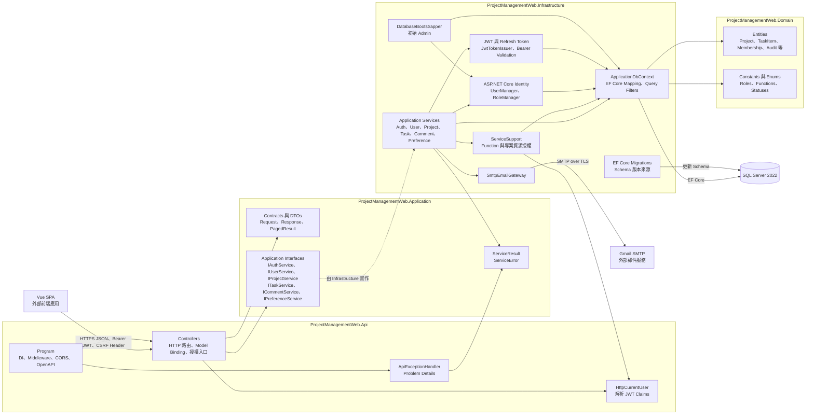
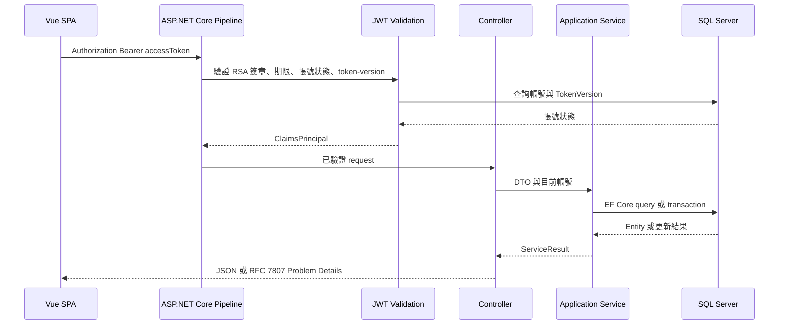
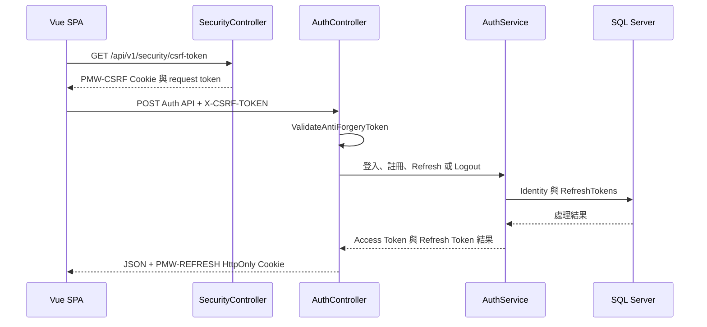
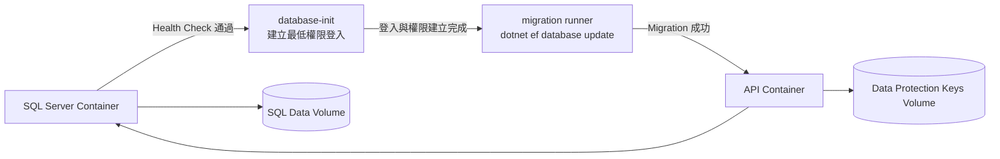

# 系統架構

本文件依目前 repository 的程式碼描述 ProjectManagementWeb BackEnd。圖採 C4 Model Level 3（Component Diagram）的視角，重點是 API 容器內的元件、責任與依賴；Vue SPA 與外部基礎設施只作為互動邊界。

## Level 3 Component Diagram



## 元件職責

| 元件 | 主要職責 | 不負責的事項 |
|---|---|---|
| `Program` | 組裝 DI、Problem Details、CSRF、CORS、OpenAPI、Authentication 與路由管線 | 業務規則與資料存取 |
| Controllers | 接收 HTTP request、套用 `[Authorize]`／Function policy、呼叫 Application interface、轉換 HTTP status | 直接操作 `DbContext` |
| Application contracts | 定義 API DTO、service interface、分頁與統一服務結果 | EF Core、SMTP 或 HTTP 實作 |
| Infrastructure services | 實作帳號、偏好、專案、Task、留言等 use case 與 transaction boundary | HTTP response 格式 |
| `ServiceSupport` | 計算全域 Function 與專案成員／ProjectManager 的資源權限 | 驗證密碼與簽發 token |
| Identity／Token | 帳號驗證、唯一系統角色、JWT 簽發與 token-version、Refresh Token rotation | 專案角色授權 |
| `ApplicationDbContext` | EF Core mapping、關聯、索引、query filter 與 seed data | 執行 HTTP 層驗證 |
| Domain | 業務實體、固定角色／Function 與狀態列舉 | 基礎設施連線與框架組態 |
| `SmtpEmailGateway` | 經 SMTP 寄送 Email 驗證信 | 決定註冊 transaction 是否成功 |

## 主要執行流程

### Bearer 業務請求



### Cookie-sensitive Auth 請求



## 依賴方向與現況說明

```text
Api -> Application -> Domain
Api -> Infrastructure -> Application / Domain
Infrastructure -> Application / Domain
```

- `Application` 只保存 contracts 與 abstractions；目前 use case 的具體類別位於 `Infrastructure/Services`。這是現行實作，不等同於將 use case 完全置於 Application layer 的嚴格 Clean Architecture。
- Controller 不直接依賴 EF Core；具體 service 經 DI 以 Application interface 注入。
- SQL Server schema 只由已提交的 EF Core migrations 演進，不使用 `EnsureCreated`。
- `Project`、`TaskItem`、`TaskItemComment` 使用 `rowversion` 進行 optimistic concurrency control。
- Project、Task 與 Comment model 皆以 `DeletedAt` 搭配 EF query filter；目前公開刪除 API 只涵蓋 Task 與 Comment，Project 尚未提供刪除 endpoint。稽核、歷史與既有留言資料不隨 Task 軟刪除而消失。

## 部署元件與啟動順序



Compose 將 migration 與 API 分離，migration 帳號擁有 schema 變更權限，API 帳號只保留執行期所需的資料存取權限。Apple Silicon 本機環境以 `linux/amd64` 模擬執行 SQL Server 2022 image，此組合不應被視為正式生產環境的支援基準。
