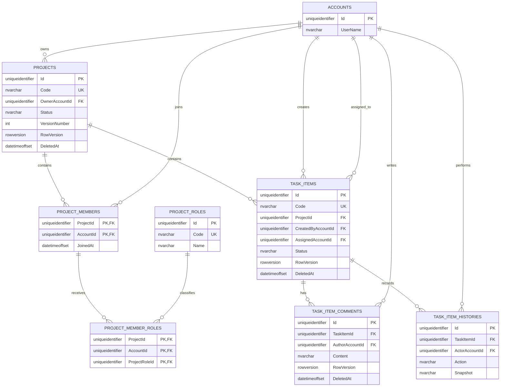
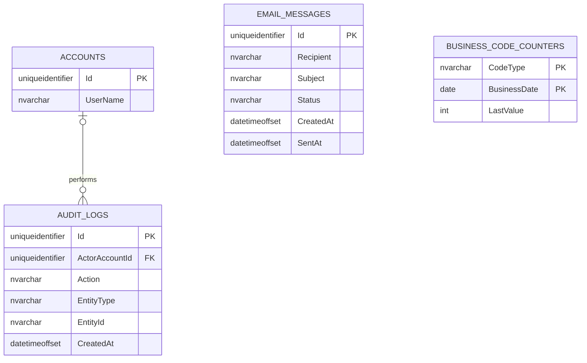

# E-R Diagram

本文件依目前 EF Core model 與 migrations 繪製。為維持可讀性，將 21 張資料表拆成 Identity／RBAC、專案／Task、系統紀錄三張圖。完整欄位定義請參閱 [TableSchema.md](TableSchema.md)。

## Identity 與 RBAC

`ACCOUNT_ROLES.UserId` 除了是複合 PK 的一部分，另有 UNIQUE index，因此一個 Account 最多只有一筆系統角色關聯。`ROLE_FUNCTIONS` 則讓一個 Role 對應多個 Function。

## 專案、成員、Task 與留言

`PROJECT_MEMBERS` 的 `(ProjectId, AccountId)` 複合 PK 保證一個帳號在同一專案只有一筆 membership；`PROJECT_MEMBER_ROLES` 的三欄複合 PK 允許該 membership 擁有多個不同 Project Role。

圖中的 `Code UK` 對 Projects 與 TaskItems 實際是帶有 `[DeletedAt] IS NULL` 的 filtered unique index。軟刪除資料不參與唯一性判斷。

## 系統紀錄

- `AuditLogs.ActorAccountId` 可為 null，以支援系統操作；FK 採 `NoAction`，避免刪除帳號時破壞稽核資料。
- `EmailMessages` 目前是獨立寄送紀錄，只保存 Recipient，沒有對 `Accounts` 建立 FK。
- `BusinessCodeCounters` 是無外鍵的 Project／Task UTC 每日計數器，複合主鍵為 `(CodeType, BusinessDate)`。
- `RefreshTokens.ReplacedByTokenId` 是應用層維護的輪替指標，目前不是資料庫 FK，因此未畫成實體關聯。

## 刪除與生命週期

| Aggregate | 行為 |
|---|---|
| Account | Identity 支援表、AccountRole、RefreshToken、Preference cascade；專案、Task、留言、歷史與稽核關聯會限制實體刪除 |
| Project | Entity 與 query filter 已支援軟刪除，但目前沒有公開刪除 API；若實體刪除，ProjectMembers cascade，但 TaskItems Restrict |
| TaskItem | 應用層使用軟刪除；Comments 與 Histories 均 Restrict，不連帶刪除 |
| TaskItemComment | 應用層使用軟刪除，保留資料供稽核 |
