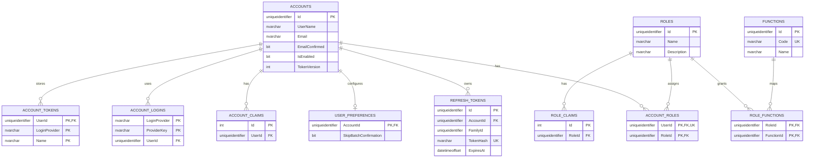
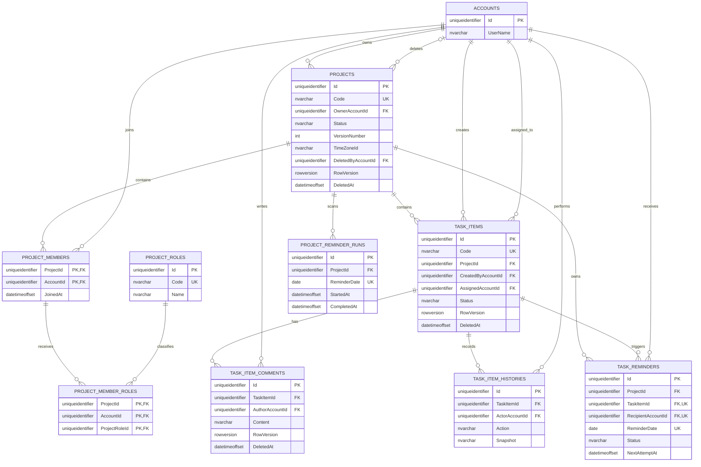
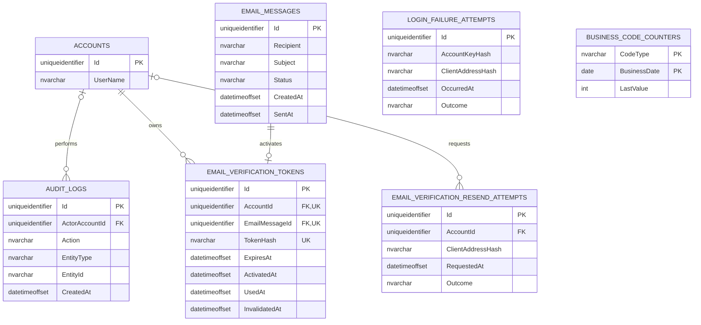

# E-R Diagram

本文件依目前 EF Core model 與 migrations 繪製。為維持可讀性，將 26 張應用資料表拆成 Identity／RBAC、專案／Task、系統紀錄三張圖；Hangfire 自有 SQL schema 不展開。完整欄位定義請參閱 [TableSchema.md](TableSchema.md)。

## Identity 與 RBAC

`ACCOUNT_ROLES.UserId` 除了是複合 PK 的一部分，另有 UNIQUE index，因此一個 Account 最多只有一筆系統角色關聯。`ROLE_FUNCTIONS` 則讓一個 Role 對應多個 Function。

## 專案、成員、Task 與留言

`PROJECT_MEMBERS` 的 `(ProjectId, AccountId)` 複合 PK 保證一個帳號在同一專案只有一筆 membership；`PROJECT_MEMBER_ROLES` 的三欄複合 PK 允許該 membership 擁有多個不同 Project Role。

圖中的 `Code UK` 對 Projects 與 TaskItems 實際是帶有 `[DeletedAt] IS NULL` 的 filtered unique index。軟刪除資料不參與唯一性判斷。

## 安全與系統紀錄

- `AuditLogs.ActorAccountId` 可為 null，以支援系統操作；FK 採 `NoAction`，避免刪除帳號時破壞稽核資料。
- `EmailMessages` 不直接參照 Account，但可透過一對一的 `EmailVerificationTokens.EmailMessageId` 對應驗證信；一般郵件與 Task 提醒信不一定有 Token。
- `EmailVerificationTokens` 只保存 Token hash；同一帳號透過 filtered UNIQUE index 同時最多一個已啟用、未使用且未失效的 Token。
- `EmailVerificationResendAttempts.AccountId` 可為 null；`LoginFailureAttempts` 完全不保存 Account FK。兩者以 SHA-256 hash 保存來源識別資訊，供多執行個體共用防濫用視窗。
- `BusinessCodeCounters` 是無外鍵的 Project／Task UTC 每日計數器，複合主鍵為 `(CodeType, BusinessDate)`。
- `RefreshTokens.ReplacedByTokenId` 已是 Delete NoAction 的 self-FK；提醒另以 Project／當地日期與 Task／收件人／提醒日期兩組 UNIQUE 保證冪等。

## 刪除與生命週期

| Aggregate | 行為 |
|---|---|
| Account | Identity 支援表、AccountRole、RefreshToken、Preference cascade；專案、Task、留言、歷史與稽核關聯會限制實體刪除 |
| Project | 公開 API 支援 Administrator／Admin 以 rowVersion 軟刪除並保存 DeletedByAccountId；不提供還原或實體刪除，子資料由 query scope 隱藏但保留 |
| TaskItem | 應用層使用軟刪除；Comments 與 Histories 均 Restrict，不連帶刪除 |
| TaskItemComment | 應用層使用軟刪除，保留資料供稽核 |
