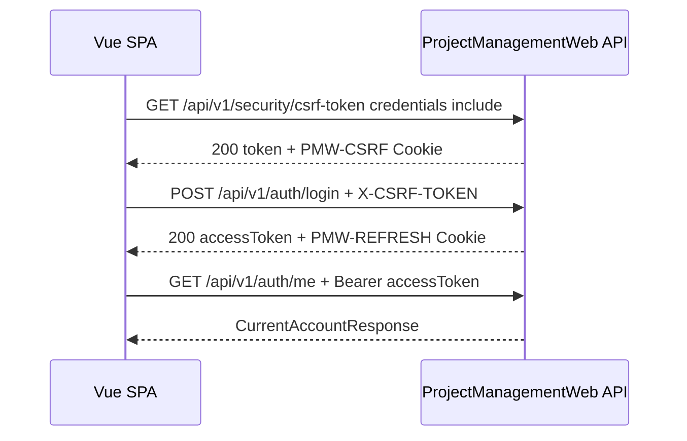

# 前端／API 契約

本文件提供 Vue SPA 串接 ProjectManagementWeb BackEnd 的實作契約。路由總覽請參閱 [ApiList.md](ApiList.md)；以下欄位名稱依 ASP.NET Core 預設 Web JSON camelCase 呈現。

## 基本設定

```ts
export const apiConfig = {
  baseUrl: import.meta.env.VITE_API_BASE_URL,
  apiPrefix: '/api/v1',
  csrfHeader: 'X-CSRF-TOKEN',
  credentials: 'include' as const,
}
```

- 所有 Auth cookie-sensitive request 都必須設定 `credentials: 'include'`。
- 業務 API 使用 `Authorization: Bearer {accessToken}`，Access Token 只保存在記憶體，不放入 Local Storage 或 Cookie。
- Refresh Token 位於 `PMW-REFRESH` HttpOnly Cookie，JavaScript 不可也不需要讀取。
- 日期時間以 ISO 8601 字串傳輸，例如 `2026-08-23T08:00:00+00:00`。
- enum 使用字串，不使用數值。
- `rowVersion` 是 Base64 字串，前端必須原樣回傳，不可自行解碼後重組。

## 建議 TypeScript 共用型別

```ts
export type Guid = string
export type IsoDateTime = string
export type RowVersion = string

export type ProjectStatus = 'Pending' | 'Active' | 'Completed' | 'Archived'
export type TaskStatus = 'Pending' | 'InProgress' | 'Blocked' | 'Completed'

export interface PagedResult<T> {
  items: T[]
  page: number
  pageSize: number
  totalCount: number
}

export interface ApiProblemDetails {
  type?: string
  title?: string
  status?: number
  detail?: string
  instance?: string
  code?: string
  traceId?: string
  errors?: Record<string, string[]>
}
```

## Auth 與 CSRF 流程

### 初始化與登入



CSRF token 建議只保存在記憶體。若頁面重整、token 遺失或伺服器回傳 antiforgery 400，重新取得 CSRF token 後再由使用者觸發 Auth 操作。

### Access Token 更新

1. 業務 API 回傳 401 時，同一時間只允許一個 refresh request，其他 request 等候結果，避免多次 rotation 互相撤銷。
2. 呼叫 `POST /api/v1/auth/refresh`，帶 `credentials: 'include'` 與有效 `X-CSRF-TOKEN`。
3. 成功後替換記憶體中的 Access Token，再重送原業務 request 一次。
4. Refresh 回傳 401 時清除登入狀態並導向登入頁；不要無限重試。

```ts
export interface AuthTokenResponse {
  accessToken: string
  accessTokenExpiresAt: IsoDateTime
}

export interface CurrentAccountResponse {
  id: Guid
  account: string
  email: string
  name: string | null
  emailConfirmed: boolean
  isEnabled: boolean
  role: 'Admin' | 'Administrator' | 'User' | 'Viewer'
  functions: string[]
}
```

登入與 refresh 的 Controller 不會把原始 Refresh Token 放入 JSON；只透過 HttpOnly Cookie 傳遞。未驗證 Email 的帳號雖可登入，但 `/auth/me` 與 Access Token 的有效角色皆為 `Viewer`。

### Auth Request

```ts
export interface RegisterRequest {
  account: string
  password: string
  email: string
  name: string | null
}

export interface LoginRequest {
  account: string
  password: string
}

export interface ConfirmEmailRequest {
  accountId: Guid
  token: string
}

export interface ResendEmailRequest {
  accountOrEmail: string
}
```

註冊密碼目前由 Identity 要求至少 10 字元，且必須同時包含大寫、小寫、數字與非英數字元。帳號與 Email 必填，後端會在建立前 trim；前端可先做相同檢查改善 UX，但仍以 API 驗證結果為準。

Email confirm URL 中的 token 必須先以 URL-safe 方式帶到前端，再由 JSON body 原樣傳給 API。Resend 固定回傳成功語意，不應以畫面差異洩漏帳號是否存在。

## 帳號、角色與偏好

```ts
export interface UserQuery {
  search?: string
  role?: string
  page?: number
  pageSize?: number
}

export interface UserResponse {
  id: Guid
  account: string
  email: string
  name: string | null
  emailConfirmed: boolean
  isEnabled: boolean
  role: string
}

export interface RoleResponse {
  id: Guid
  name: string
  functions: string[]
}

export interface UpdateRoleRequest {
  roleId: Guid
}

export interface UpdateUserStatusRequest {
  isEnabled: boolean
}

export interface UpdateAdministrationRequest {
  roleId: Guid
  isEnabled: boolean
}

export interface PreferenceResponse {
  skipBatchConfirmation: boolean
}

export interface UpdatePreferenceRequest {
  skipBatchConfirmation: boolean
}
```

- 角色更新只傳單一 `roleId`；成功後是取代角色，不是加入第二個角色。
- 目前使用者的角色或狀態被異動後，既有 Access Token 會因 token-version 失效。前端應視下一次 401 為需要重新登入。
- 未驗證 Email 的帳號不能提升為非 Viewer，API 回傳 422。

## Project 契約

```ts
export interface ProjectQuery {
  search?: string
  status?: ProjectStatus
  page?: number
  pageSize?: number
}

export interface CreateProjectRequest {
  name: string
  description: string | null
  ownerAccountId: Guid
}

export interface UpdateProjectRequest {
  name: string
  description: string | null
  ownerAccountId: Guid
  status: ProjectStatus
  rowVersion: RowVersion
}

export interface ProjectResponse {
  id: Guid
  code: string
  name: string
  description: string | null
  ownerAccountId: Guid
  status: ProjectStatus
  createdAt: IsoDateTime
  updatedAt: IsoDateTime
  rowVersion: RowVersion
}

export interface ProjectRoleResponse {
  id: Guid
  code: string
  name: string
}

export interface ProjectMemberResponse {
  accountId: Guid
  account: string
  name: string | null
  roles: ProjectRoleResponse[]
}

export interface MemberCandidateResponse {
  id: Guid
  account: string
  name: string | null
}

export interface SaveProjectMemberRequest {
  accountId: Guid
  projectRoleIds: Guid[]
}

export interface UpdateProjectMemberRequest {
  projectRoleIds: Guid[]
}
```

- 建立專案時不傳 `code`；後端依 UTC 日期產生 `PRJ-YYYYMMDD######`，Project 每日獨立從 `000001` 起算。
- 建立專案後，Owner 會自動成為 member 並取得 `ProjectManager`；移交 Owner 時亦會在同一交易補上新 Owner 的 `ProjectManager`。
- 成員候選人使用 `GET /projects/{id}/member-candidates`，分頁結果只揭露 `accountId`、`account`、`name`。
- 成員角色 UI 必須使用複選；`projectRoleIds` 至少一筆。PUT 是完整取代角色集合，不是增量 patch。
- Owner 必須維持專案成員身分；移除 Owner 前要先透過 Project PUT 移交。
- Viewer 即使資料中具有 ProjectManager 角色，仍不能顯示或執行寫入操作。

## Task 契約

```ts
export interface TaskQuery {
  search?: string
  status?: TaskStatus
  assignedAccountId?: Guid
  onlyMine?: boolean
  sortBy?: 'createdAt' | 'deadline' | 'status' | 'code'
  sortDirection?: 'asc' | 'desc'
  page?: number
  pageSize?: number
}

export interface CreateTaskRequest {
  title: string
  description: string | null
  assignedAccountId: Guid
  startAt: IsoDateTime
  deadline: IsoDateTime
}

export interface UpdateTaskRequest {
  title: string
  description: string | null
  assignedAccountId: Guid
  startAt: IsoDateTime
  deadline: IsoDateTime
  status: TaskStatus
  rowVersion: RowVersion
}

export interface UpdateAssignedTaskRequest {
  status: TaskStatus
  deadline: IsoDateTime
  rowVersion: RowVersion
}

export interface BatchTaskVersion {
  taskId: Guid
  rowVersion: RowVersion
}

export interface BatchUpdateTaskStatusRequest {
  tasks: BatchTaskVersion[]
  targetStatus: TaskStatus
}

export interface TaskResponse {
  id: Guid
  code: string
  projectId: Guid
  title: string
  description: string | null
  createdByAccountId: Guid
  assignedAccountId: Guid
  startAt: IsoDateTime
  deadline: IsoDateTime
  status: TaskStatus
  createdAt: IsoDateTime
  updatedAt: IsoDateTime
  rowVersion: RowVersion
}

export interface BatchUpdateResponse {
  updatedCount: number
}
```

- 建立 Task 時不傳 `code`；後端依 UTC 日期產生 `TASK-YYYYMMDD######`，Task 每日獨立從 `000001` 起算。
- 指派者必須是該專案成員，且 `deadline` 不可早於 `startAt`。
- 一般 User 透過 `status-and-deadline` 只修改指派給自己的 Task；管理者的完整修改使用 PUT。
- Batch request 必須帶每筆目前的 `rowVersion`。後端先驗證全部資料，再以單一 transaction 寫入；任一筆失敗時整批不更新。
- 刪除 Task 的 `rowVersion` 放在 query string，必須經 `encodeURIComponent`。

## Comment 契約

```ts
export interface CreateCommentRequest {
  content: string
}

export interface UpdateCommentRequest {
  content: string
  rowVersion: RowVersion
}

export interface CommentResponse {
  id: Guid
  taskItemId: Guid
  authorAccountId: Guid
  content: string
  createdAt: IsoDateTime
  updatedAt: IsoDateTime
  rowVersion: RowVersion
}
```

- `content.trim()` 後必須為 1–2000 字。
- 一般使用者只能修改或刪除自己的留言。
- 刪除留言的 `rowVersion` 放在 query string。

## Function 與畫面權限

前端可用 `/api/v1/auth/me` 的 `functions` 控制按鈕顯示，但這只改善 UX，不能取代後端授權。建議集中定義：

```ts
export const functions = {
  accountsRead: 'accounts.read',
  accountsManageRole: 'accounts.manage-role',
  accountsManageStatus: 'accounts.manage-status',
  projectsRead: 'projects.read',
  projectsCreate: 'projects.create',
  projectsManageAll: 'projects.manage-all',
  projectMembersManageAll: 'project-members.manage-all',
  tasksRead: 'tasks.read',
  tasksCreate: 'tasks.create',
  tasksUpdateAny: 'tasks.update-any',
  tasksUpdateAssigned: 'tasks.update-assigned',
  tasksDelete: 'tasks.delete',
  commentsRead: 'comments.read',
  commentsCreate: 'comments.create',
  commentsUpdateOwn: 'comments.update-own',
  commentsDeleteOwn: 'comments.delete-own',
  preferencesReadOwn: 'preferences.read-own',
  preferencesUpdateOwn: 'preferences.update-own',
} as const
```

專案層權限還需要資源資料才能判斷，例如是否為該專案 ProjectManager。前端可以依成員資料控制 UI，但 API 永遠會重新驗證 membership、系統角色與 Function。

## 錯誤與並行衝突

```ts
export async function readProblem(response: Response): Promise<ApiProblemDetails> {
  const contentType = response.headers.get('content-type') ?? ''
  if (!contentType.includes('application/problem+json') &&
      !contentType.includes('application/json')) {
    return { status: response.status, title: response.statusText }
  }

  return await response.json() as ApiProblemDetails
}
```

| HTTP status | 前端處理建議 |
|---:|---|
| 400 | 顯示欄位驗證或 CSRF 錯誤；CSRF 遺失時重新取得 token |
| 401 | 嘗試一次 refresh；refresh 也失敗則清除 session |
| 403 | 顯示無權限，不要當作資料不存在 |
| 404 | 返回列表並重新載入，或顯示資料已不存在 |
| 409 | 對 rowversion 衝突顯示「資料已被更新」，重新取得最新資料後讓使用者決定是否重做 |
| 422 | 顯示可修正的業務規則錯誤，例如 Email 未驗證、指派者不是成員或日期不合法 |
| 500 | 顯示通用錯誤與 `traceId`，不要直接顯示內部例外 |

`code` 是穩定的程式判斷候選值，`detail` 是顯示／除錯文字。前端不應以中文 `detail` 字串比對流程。

## Query string 與快取注意事項

- `page` 小於 1 時後端校正為 1；`pageSize` 會限制在 1–100，前端仍應只提供合法選項。
- 搜尋、filter、sorting 與 page 建議同步到 Vue Router query，以便返回列表時保留條件。
- 省略 optional query，而不是送出字串 `undefined` 或 `null`。
- Auth 與個人資料 response 不應放入共享 CDN cache。
- 更新成功後，以 API 回傳的新 `rowVersion` 覆蓋 store 中的舊值。

## 最小 Fetch 包裝範例

```ts
let accessToken: string | null = null
let csrfToken: string | null = null

export async function loadCsrfToken(): Promise<void> {
  const response = await fetch(`${apiConfig.baseUrl}${apiConfig.apiPrefix}/security/csrf-token`, {
    credentials: apiConfig.credentials,
  })
  if (!response.ok) throw await readProblem(response)
  const body = await response.json() as { token: string }
  csrfToken = body.token
}

export async function apiFetch(path: string, init: RequestInit = {}): Promise<Response> {
  const headers = new Headers(init.headers)
  headers.set('Accept', 'application/json')
  if (init.body) headers.set('Content-Type', 'application/json')
  if (accessToken) headers.set('Authorization', `Bearer ${accessToken}`)

  return await fetch(`${apiConfig.baseUrl}${apiConfig.apiPrefix}${path}`, {
    ...init,
    headers,
    credentials: apiConfig.credentials,
  })
}

export async function authPost(path: string, body?: unknown): Promise<Response> {
  if (!csrfToken) await loadCsrfToken()

  return await apiFetch(path, {
    method: 'POST',
    headers: { [apiConfig.csrfHeader]: csrfToken! },
    body: body === undefined ? undefined : JSON.stringify(body),
  })
}
```

正式 client 還需加入 refresh single-flight、request cancellation、統一 Problem Details mapping 與 route-level loading state；不要在 interceptor 中對 401 無上限重送。
